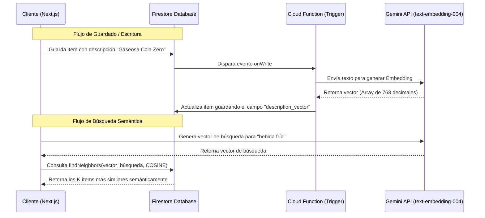

# Arquitectura de Búsqueda Vectorial Semántica (Vector Search) para izicode

Este documento detalla la planificación arquitectónica y técnica para implementar la búsqueda semántica en la base de datos de productos de **izicode** utilizando **Cloud Firestore Vector Search** y **Gemini Vertex AI**.

---

## 1. Concepto y Funcionamiento
A diferencia de las búsquedas tradicionales por texto exacto o por prefijo, la **Búsqueda Vectorial** permite encontrar documentos basándose en su significado conceptual.
* **Ejemplo**: Si un cliente escribe `"bebida refrescante sin azúcar"`, el sistema será capaz de encontrar `"gaseosa cola zero 1.5l"`, incluso si ninguna palabra coincide exactamente.

---

## 2. Diagrama de Arquitectura


---

## 3. Plan de Implementación paso a paso

### Paso 1: Configurar la Cloud Function de Sincronización
Se creará una Cloud Function en Firebase (`index.js` o `index.ts`) para interceptar las inserciones de ítems y poblar automáticamente su vector:

```typescript
import * as functions from 'firebase-functions';
import * as admin from 'firebase-admin';
import { GoogleAuth } from 'google-auth-library';

admin.initializeApp();
const db = admin.firestore();

// API de Vertex AI para embeddings
const VERTEX_ENDPOINT = 'https://us-central1-aiplatform.googleapis.com/v1/projects/TU_PROYECTO/locations/us-central1/publishers/google/models/text-embedding-004:predict';

export const generateItemEmbedding = functions.firestore
  .document('users/{userId}/batches/{batchId}/items/{itemId}')
  .onWrite(async (change, context) => {
    const data = change.after.exists ? change.after.data() : null;
    const oldData = change.before.exists ? change.before.data() : null;

    // Si el documento se eliminó o la descripción no cambió, no hacer nada
    if (!data || (oldData && oldData.description === data.description && data.description_vector)) {
      return null;
    }

    const description = data.description || '';
    if (!description.trim()) return null;

    try {
      // 1. Obtener Token de Autenticación de Google Cloud
      const auth = new GoogleAuth({ scopes: 'https://www.googleapis.com/auth/cloud-platform' });
      const client = await auth.getClient();
      const accessToken = await client.getAccessToken();

      // 2. Consultar el Modelo de Embedding de Google Vertex AI
      const response = await fetch(VERTEX_ENDPOINT, {
        method: 'POST',
        headers: {
          'Authorization': `Bearer ${accessToken.token}`,
          'Content-Type': 'application/json'
        },
        body: JSON.stringify({
          instances: [{ content: description.toLowerCase().trim() }]
        })
      });

      const result = await response.json();
      const embedding = result.predictions[0].values;

      // 3. Guardar el vector en el documento
      return change.after.ref.update({
        description_vector: embedding
      });
    } catch (error) {
      console.error('Error generating embedding:', error);
      return null;
    }
  });
```

---

### Paso 2: Declarar el Índice Vectorial en Firestore
Para buscar por proximidad de vectores, crearemos un índice compuesto vectorial en el archivo `firestore.indexes.json`:

```json
{
  "indexes": [],
  "fieldOverrides": [
    {
      "collectionGroup": "items",
      "fieldPath": "description_vector",
      "indexes": [
        {
          "queryScope": "COLLECTION",
          "order": "ASCENDING"
        },
        {
          "queryScope": "COLLECTION",
          "vectorConfig": {
            "dimension": 768,
            "flat": {}
          }
        }
      ]
    }
  ]
}
```

Para desplegarlo de forma remota:
```bash
firebase deploy --only firestore:indexes
```

---

### Paso 3: Consultas de Similitud Semántica desde Next.js
En el componente de búsqueda, primero convertimos el texto de búsqueda del usuario a vector y luego consultamos en Firestore utilizando el operador `findNeighbors`:

```typescript
import { collection, query, getDocs, findNeighbors } from 'firebase/firestore';

async function performVectorSearch(userId: string, batchId: string, searchText: string) {
  // 1. Generar vector para la query del usuario usando Vertex / Gemini
  const queryVector = await getQueryEmbedding(searchText);

  // 2. Buscar en la subcolección de items
  const itemsRef = collection(db, 'users', userId, 'batches', batchId, 'items');
  const q = query(
    itemsRef,
    findNeighbors('description_vector', queryVector, {
      limit: 10,                 // Traer los 10 más relevantes
      distanceMeasure: 'COSINE'  // Similaridad coseno
    })
  );

  const querySnapshot = await getDocs(q);
  const results = [];
  querySnapshot.forEach(doc => {
    results.push({ id: doc.id, ...doc.data() });
  });
  return results;
}
```

---

## 4. Análisis de Costos (Basado en Precios GCP)
1. **Generación de Embeddings (`text-embedding-004`)**:
   * **Costo**: $0.000025 USD por cada 1,000 tokens (aprox. 4,000 letras).
   * **Para 10,000 items**: Menos de **$0.01 USD** en total.
2. **Cloud Functions**:
   * **Costo**: 2 millones de llamadas gratis al mes. $0.0000004 USD por llamada extra.
3. **Almacenamiento en Firestore**:
   * Un vector de 768 dimensiones añade **3 KB** por producto.
   * **Para 100,000 items**: Aprox. 300 MB de espacio, lo que cuesta **$0.05 USD** al mes.
4. **Lecturas de Búsqueda**:
   * Cada búsqueda consume exactamente el número de lecturas correspondientes a su límite (ej. si el límite es 5, consume 5 lecturas de Firestore).
